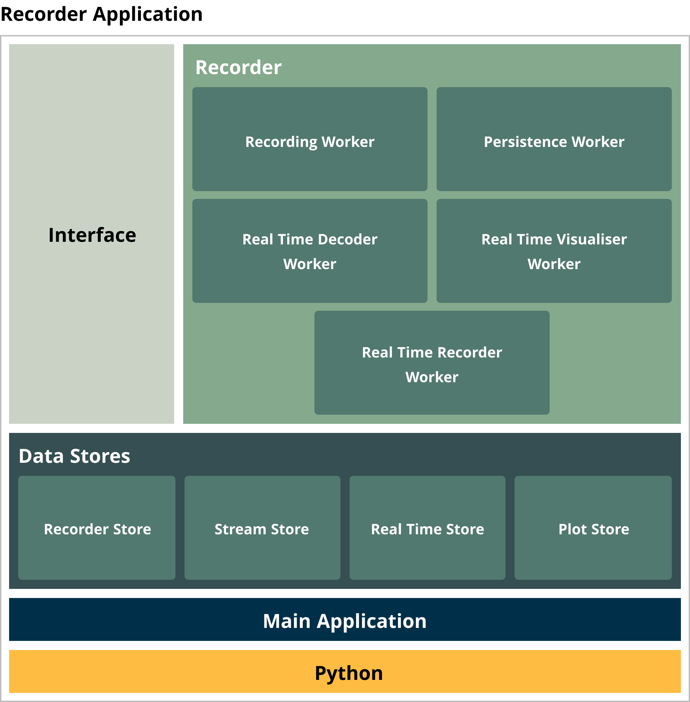
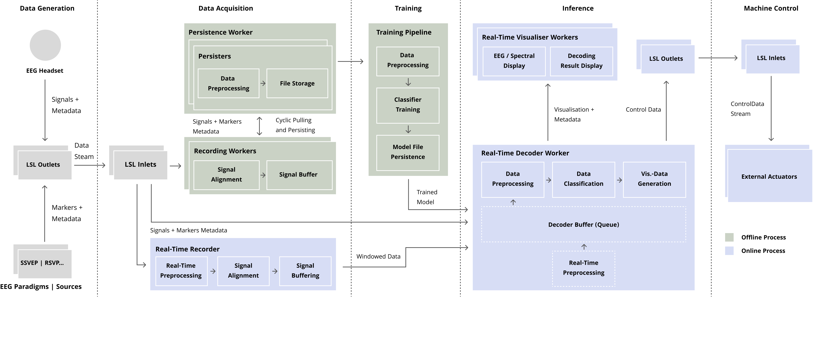
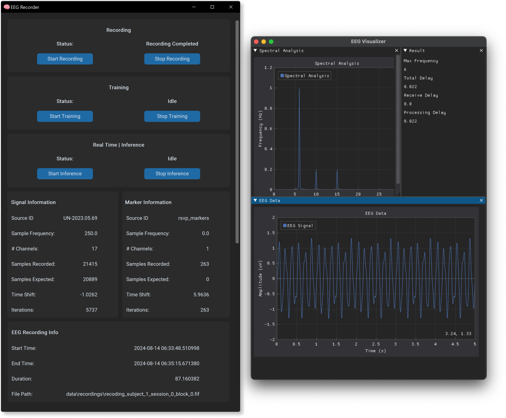

# EEG Prototyping System

This Readme file offers a technical documentation to the EEG prototyping system.
The recording prototype is written in Python and employs major data science and EEG processing
libraries.

## Installation
The limited number of external python packages is listed in the `requirements.txt` file.
It is recommended to use a new virtual or conda environment for their installation.
The installation was tested by using Python version `3.12.4`.

## Concepts
To enable EEG recording, processing and decoding without reliance on monolithic, UI-based third-party tools, a dedicated
system has been developed. The developed system is called recorder in this work. This section presents the recorder
interface and explains its underlying architecture.

From a high-level perspective, the recorder developed in this project establishes a flexible framework for data
acquisition, preprocessing, short-term classifier training, real-time decoding, and visualisation of real-time EEG data.
The subsequent figures provide two perspectives on the system’s architectural design.
While figure (1) presents the building blocks
of the recorder, figure (2) provides a procedural view of the relationships between the modules and the data flow.

The primary Python process hosts the TKInter-based user interface along with the recorder, which manages the subordinate
workers. Each worker independently completes specific tasks in parallel with other workers. In this project, workers can
be process- or thread-based, and they can be largely inter- changed due to their consistent API. Performance tests and
experiments revealed that a multiprocessing approach, which enables parallelism rather than mere concurrency, proved to
be the most effective.

A significant implication of adopting a multiprocessing approach is the necessity to distribute data among processes.
While threads can access shared memory instances, data must be distributed among processes when utilising multiprocessing.
As a result, data used by multiple workers is shared via stores, which employ managed variables provided by the Python
multiprocessing API to serve as data transfer objects.

*Figure (1)*

*Figure (2)*

As illustrated in figure (2) previous, the system operates through a four-layered process comprising data generation,
data acquisition, model training, and inference. Each layer employs distinct workers for specific tasks and utilises the lab 
streaming layer (LSL) for communication between the recorder and external devices or systems. The flexible worker architecture 
would also allow for the seamless integration of alternative communication layers, such as BrainFlow.
Therefore, a new subtype of recording worker could be developed to utilise the BrainFlow API in place of the LSL API 
while using the existing base functionalities of a recording worker.

During the data generation phase, EEG signals are acquired and streamed to the LSL using an EEG headset. 
Along with the signals and their timestamps, additional metadata such as sampling frequency is shared. 
The recorder also facilitates the alignment of multiple marker timestamps with the recorded signals originating 
from separately implemented EEG paradigms.

In the data acquisition phase, a worker opens an LSL stream to receive data from an LSL source. The integration of 
LSL is achieved through MNE-LSL, ensuring a seamless transition to the MNE API. The streamed data is stored in a
ring buffer, from which it can be consumed by a worker. Each recording worker establishes a connection to an individual 
LSL stream and continuously retrieves data in chunks by iterating over the stream’s ring buffer. 
The size of each data chunk is determined by the amount of new data available in the ring buffer, which is influenced 
by both the sampling frequency of the EEG headset in use and the frequency at which the worker collects data from the 
buffer. The recorder system can initiate multiple recording workers to receive data from multiple streams simultaneously. 
Additionally, the library provides a dejitter smoothing algorithm to eliminate timing variations in the received signals.

Currently, two separate recorder workers independently open input streams via an LSL stream inlet. The first recording
worker, stores the received data in a file. The second stream, overseen by either the real- time recorder worker or
the decoder worker, retrieves data for real-time decoding and visualisation.

Based on the number of signal and marker streams, the recorder creates a corresponding number of recording workers to 
independently retrieve and buffer each signal. The recorder offers two strategies for data persistence: either the 
main process persists the data collected from the recording workers at the end of a recording session, or a separate 
persistence worker cyclically retrieves buffered data and appends it to a file. This method allows for recording longer 
sequences without risking a buffer or memory overflow.

Each recording worker can host multiple persisters responsible for saving data to various destinations, such as files. 
The recorder provides a generic interface for implementing custom persisters. Currently, the recorder supports an MNE 
raw object persister, which encapsulates raw signals, signal annotations from the marker stream, and recording metadata,
including the headset montage, into an MNE-compatible format. The final output is stored in a functional 
image file format (FIFF | .fif).

With an existing recording, a classifier can be trained using a configurable training pipeline tailored to specific 
experimental paradigms. For initial verification of the system, the recorder includes pipelines for an SSVEP prototype 
as well as data independent demonstration mode. The configurable pipeline adheres to a ScikitLearn-compatible API, 
facilitating the straightforward implementation of pipeline step extensions. For Pytorch-based models, the models can 
be wrapped with a Skorch wrapper. After a successful training process, the model is stored in a file for further use 
during inference. The recorder is optimised for short training processes, with longer training sessions recommended to 
be conducted with external pipelines.

For inference, the recorder provides two methods for accessing real-time EEG data: through an inter- mediate buffer 
within the real-time recorder or directly via the real-time decoder worker. The real-time recorder offers data in 
consecutive windows of defined length and offset time, while the direct access method uses a rolling queue of 
predetermined length, containing the most recent data from the EEG headset.

Depending on the paradigm, a real-time decoder worker can be implemented following a predefined interface. The initial 
version of the recorder includes an implementation of an SSVEP decoder worker. The real-time decoder processes the 
signal and generates BCI paradigm-specific visualisation data, which is stored in a plot store for data transfer. 
To control external actuators, multiple LSL outlets can be attached to a decoder to stream event-related integer 
identifiers.

Visualiser workers consume the real-time data stored in plot stores for presentation in a separate GUI window. This 
architecture enables visualisation rendering to execute in a non-blocking, independent manner. Furthermore, multiple 
visualiser workers can provide various perspectives on the decoded data. The final interface of the recorder, along 
with a sample implementation of an SSVEP visualiser, is presented in figure (3). The visualiser offers independent 
graphs of the real-time signal from a selected EEG channel and a spectral analysis of the same channel. Additionally, 
another section displays the decoding result along with metadata.

*Figure (3)*

The purpose of the real-time visualisation was not to provide a detailed display of raw data, as this function can be 
effectively handled by other available open-source backends, such as BrainFlow. Although the current visualisation 
could be expanded for this purpose, the primary objective was to facilitate simple real-time verifications of the system.
This includes tasks such as spectral decoding, which can be achieved using the same methods employed in the decoding 
pipeline and leveraging well-established Python packages in this domain.

Given that the recording time offset , and processing time are highly dependent on the hardware resources and pipeline
configurations utilised, a static analysis provides only limited expressiveness. Consequently, the recorder includes a 
real-time visualisation of the current recording offset and processing time.

The recording offset is calculated by determining the difference between the recording timestamp of the last sample in 
a data chunk and the timestamp provided by a synchronised LSL clock at the moment that sample is retrieved from the 
stream’s ring buffer. In other words, this metric represents the time elapsed from when the EEG headset (in this case, 
the Unicorn LSL Driver) assigns a signal timestamp to when the data becomes available for processing within the system’s 
pipeline. Consequently, this time delay is also affected by the specific implementation of the LSL driver for the EEG 
headset being used. Additionally, it is important to recognise that this measurement may not fully account for the 
inherent time delay between the actual brain activity and the moment the data is transmitted to the LSL layer by the 
EEG headset.

The processing time is measured as the difference between the time of data retrieval from the buffer and the time after 
the data has been written to the plot store.

Table (1) presents the recording time offset , and processing time achieved using a Dell Notebook equipped with an Intel
Core i9 processor running at 2.6 GHz and 16 GB of RAM, measured over 1500 cycles. As discussed in the previous section,
both metrics are highly dependent on the hardware and pipeline configurations (including the EEG headset, computing unit,
preprocessing techniques, and decoders) and, therefore, cannot be directly compared with other systems. However, the
measured metrics provide an indication of the performance achieved with the implemented system and can be used to
validate the requirements for a specific experiment.

| **Measurement**      | **Mean**   | **Standard Deviation** |
|----------------------|------------|------------------------|
| Recording Delay      | 0.007568s  | 0.007936s              |
| Processing Delay     | 0.074996s  | 0.008153s              |
| Total Delay          | 0.082875s  | 0.009847s              |

*Table (1)*

## Configurations
The `YAML` based configurations play an important role in this project, as they are not integrated
to the user interface yet.
The configuration file tree builds the foundation of all supported configurations in this project.
The configuration tree is loaded dynamically into a `DictConfig` using [Hydra Config](https://hydra.cc/).
The configuration tree root starts at `/config/config.yaml`.

### Configuration Root
The configuration root defines the composition of the child configuration files for an application
execution. The `defaults` key-value section defines the current composition with the key referring to the dictionary
and the value to the used files. By exchanging the child files (values), different compositions of 
configurations can be created. They are named defaults as they could also exchanged by application's start command and
corresponding attributes.

### Experiments
The main configurations are directed via the experiment sub-configs located at `config/experiment/**`.
The experiments mainly define the pipelines inclusively the different levels of preprocessing (Real-Time preprocessing,
Raw preprocessing, Epoch Preprocessing etc.).
Currently three experiments are supported.

1. **Demo-Experiment:** The demo experiment is here to showcase the system by displaying a noisy sinusoid,
   along with a SSVEP decoder to visualise the most prominent frequency within the mocked signal.
2. **SSVEP-Experiment:** The SSVEP experiment directs the record-train-inference process of an SSVEP paradigm.
3. **RSVP-Experiment:** The implemented RSVP experiment is currently only a verification of the paradigm without a
   dedicated implementation of an RSVP decoder.

### Headset
The headset configurations contain meta information about the utilised EEG headset.
The most important information contained is the `source_id`, which is required to set up the LSL stream connection
to the headset.
Further, contains the configuration file the information to the channels and their types, required to
obtain valid MNE Raw objects and to display topographic maps.

### Persistence
Important configurations regarding recording persistence can be made in the files contained in folder 
`config/persistence/**`. 
Persisters are used to define how the recorded signal is persisted. Currently only persisters to store the signal 
in a MNE Raw (`mne_raw_persister`) file are implemented.
Further, in the `persisting_mode` can be defined with (`replace` | `continuous`) either if the signal should be 
stored in all at once (risk of buffer overflow) or continuously with a recording worker defined in
`/config/persistence/workers/**`. In the persisting worker it can be defined in which interval the buffered signal
should be written to the file (default 30s).

### Decoders
In the decoder settings (`/config/decoders/**`), properties to the LSL outlet connections can be set for external
actuator control.

### Real-Time
In the recording configurations (`/config/real_time/**`), properties (`recording_mode`) can be set to define whether 
the decoder itself should directly receive the signal or if a dedicated real-time recording worker should be used as 
indicated in figure (2). Further, the utilised decoder can be defined.

### Visualization
The visualisation configs (`/config/visualzation/**`) offer particular configurations about the real-time visualisations.
This includes value ranges of the displayed graphs or their axis labels.

## Pipeline
The supported pipeline consists of several layer of preprocessing as well as a Scikit-Learn pipeline.

### Real-Time (RT) preprocessing
RT preprocessing refers to preprocessing techniques applied to the signal chunks of varying length received of the LSL
interface.
This allows to perform fundamental preprocessing on the signal which can then be consumed by the subsequent workers.
It was required to prevent edge effects in the considered signal window.
For instance, Bandpass filters retain their coefficient states between subsequent chunks.
New real-time preprocessors can be added to `/lib/preprocess/rt_preprocessor.py`.
Currently, the following RT preprocessors are supported.

- BANDPASS_FILTER = 'bandpass_filter' 
- NOTCH_FILTER = 'notch_filter'

### Raw Preprocessor
Raw preprocessors are applied to MNE Raw objects.
Raw preprocessors are used during before a decoder training and during real-time decoding.
In which pipeline (`training` | `inference`) they should be applied can be defined in the specific stages array of
the pipeline configuration of the specific experiments.
New raw preprocessors can be added to `/lib/preprocess/raw_preprocessors.py`.
Currently, the following Raw Preprocessors are supported:

- NOTCH_FILTER = 'notch_filter' 
- BANDPASS_FILTER = 'bandpass_filter' 
- RESAMPLE = 'resample' 
- REFERENCE = 'reference' 
- CHANNEL_INTERPOLATION = 'channel_interpolation' 
- CHANNEL_PICKER = 'channel_picker'

### Epoch Preprocessor
The epoch preprocessors target the MNE Epoch objects, after epoching an MNE raw object.
They support similar functionalities as the Rar preprocessors, however, epochs consist of a defined epoch length,
which allows additional preprocessing possibilities.
New raw preprocessors can be added to `/lib/preprocess/epoch_preprocessors.py`.
Currently, the following Epoch Preprocessors are supported:

- BANDPASS_FILTER = 'bandpass_filter' 

### Preprocessor
The plain preprocessors target the data directly retrieved by either the raw signal (during inference) or by the epochs.
This allows to preprocess the retrieved numpy arrays directly.
Currently, plain preprocessors are only supported during inference but could simply be added to the training pipeline.
Also consider the possibility of adding this type of preprocessors within the Scikit-Learn based pipeline.
New preprocessors can be added to `/lib/preprocess/data_preprocessors.py`.
Currently, the following Preprocessors are supported:

- BANDPASS_FILTER = 'bandpass_filter' 
- EEGScaler = 'eeg_scaler' 
- EpochWindowSplitter = 'epoch_window_splitter' 
- FFT = 'fft' 
- KALMAN_FILTER = 'kalman_filter'
- NOTCH_FILTER = 'notch_filter'
- SklearnClassifierReshape = 'sklearn_classifier_reshape'

### Pipeline Steps
The actual training pipeline is based on Scikit-Learn it's Pipeline interface, so every Scikit-Learn supported
pipeline step is also supported in the prototyping system. Moreover, like this, custom steps can simply be added
by inheriting from the corresponding interfaces. If you want to integrate `PyTorch` based models, have a look at
the `Skortch` wrapper library.
Custom pipeline steps can be integrated in `/lib/train/pipeline.py`
Currently the following Scikit-Learn pipeline steps are supported:

- CHANNEL_RESHAPE = 'CHANNEL_RESHAPE' 
- WINDOW_SPLITTER = 'WINDOW_SPLITTER' 
- AVERAGER = 'AVERAGER' 
- FFT = 'FFT' 
- FILTERBANK = 'FILTERBANK' 
- XDAWN = 'XDAWN' 
- CONSECUTIVE_MAJORITY_VOTE_CLASSIFIER = 'CONSECUTIVE_MAJORITY_VOTE_CLASSIFIER' 
- RANDOM_FOREST = 'RANDOM_FOREST' 
- SVM = 'SVM' 
- R_SVM = 'R_SVM' 
- MDM = 'MDM'
- CCA = 'CCA' 
- ECCA = 'ECCA' 
- MSCCA_AND_MSETRCA = 'MSCCA_AND_MSETRCA'